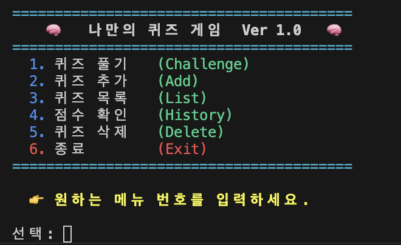
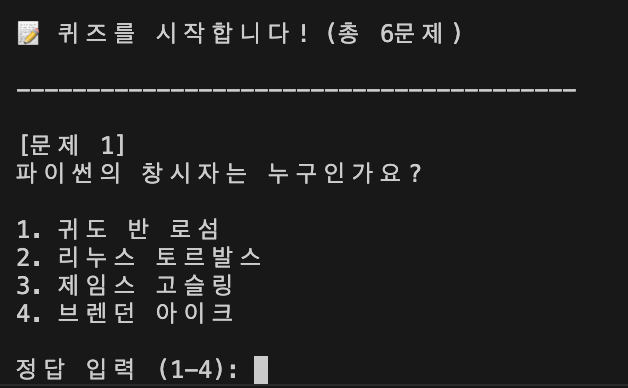
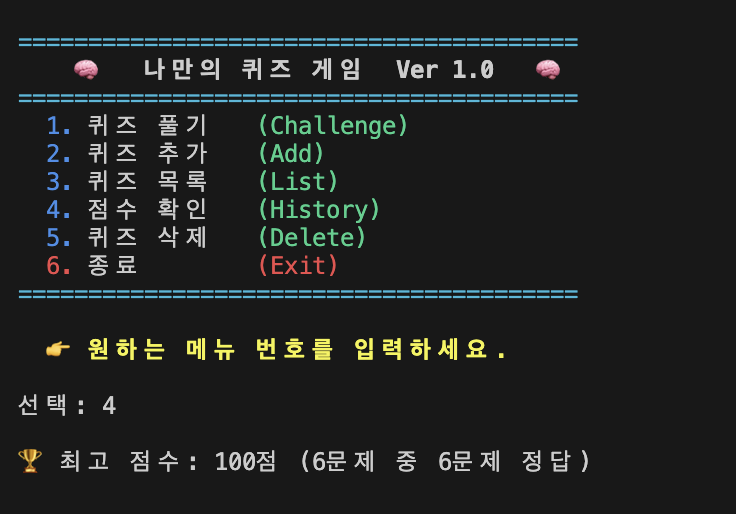

# 나만의 퀴즈 게임 설계 문서

## 1. 프로젝트 개요

이 프로젝트는 Python으로 만든 콘솔 기반 퀴즈 게임이다.  
사용자는 메뉴를 통해 퀴즈를 풀고, 새로운 퀴즈를 추가하고, 등록된 퀴즈 목록을 확인하고, 최고 점수를 확인할 수 있다.  
퀴즈 데이터와 점수 데이터는 `state.json`에 저장되므로 프로그램을 종료한 뒤 다시 실행해도 이전 상태가 유지된다.

이 프로젝트의 목표는 단순히 "작동하는 프로그램 1개"를 만드는 데 있지 않다.  
아래 내용을 실제 코드 안에서 연결해서 이해하는 데 목적이 있다.

- Python 기본 문법
- 조건문과 반복문
- 함수와 메서드
- 클래스와 객체
- 파일 입출력
- JSON 저장 구조
- 예외 처리
- 코드 구조화
- Git 기반 버전 관리

## 2. 퀴즈 주제 선정 이유

퀴즈 주제는 `Python 기초 문법`이다.

이 주제를 선택한 이유는 다음과 같다.

- 프로젝트를 구현하면서 동시에 Python 개념을 복습할 수 있다.
- 변수, 조건문, 반복문, 함수, 클래스 같은 핵심 개념을 문제로 다시 정리할 수 있다.
- 새로운 개념을 배울 때마다 퀴즈를 계속 추가하며 프로젝트를 확장할 수 있다.

## 3. 실행 방법

### 3-1. 실행 환경

- Python 3.10 이상 권장
- 외부 라이브러리 없이 표준 라이브러리만 사용

### 3-2. 실행 명령어

```bash
python3 main.py
```

## 4. 실행 화면

### 4-1. 메인 메뉴



### 4-2. 퀴즈 진행 화면



### 4-3. 점수 확인 화면



## 5. 기능 목록

- 메뉴 출력
- 퀴즈 풀기
- 퀴즈 추가
- 퀴즈 목록 확인
- 최고 점수 확인
- 퀴즈 삭제
- `state.json` 저장 및 불러오기
- 잘못된 입력 처리
- `KeyboardInterrupt`, `EOFError` 안전 종료

## 6. 프로그램의 전체 실행 흐름

이 프로젝트는 아래 순서로 동작한다.

1. `main.py`가 실행된다.
2. `QuizGame` 객체를 생성한다.
3. `QuizGame`은 시작하자마자 `state.json`을 읽는다.
4. 저장 파일이 정상이라면 퀴즈 목록과 최고 점수를 메모리에 불러온다.
5. 저장 파일이 없거나 손상되었다면 기본 퀴즈 데이터로 복구한다.
6. 메인 메뉴를 출력한다.
7. 사용자가 메뉴 번호를 입력한다.
8. 입력한 번호에 따라 퀴즈 풀기, 퀴즈 추가, 목록 보기, 점수 확인, 퀴즈 삭제 중 하나를 실행한다.
9. 데이터가 바뀌는 순간과 프로그램 종료 시점에 다시 `state.json`에 저장한다.

이 흐름을 이해하면 코드가 여러 파일로 나뉘어 있어도 전체 구조를 놓치지 않게 된다.

## 7. 왜 코드를 여러 파일로 나눴는가

처음에는 모든 코드를 `main.py`에 작성할 수 있다.  
하지만 기능이 늘어나면 한 파일이 너무 길어지고, "입력 처리", "저장", "게임 진행", "출력"이 한곳에 섞이면서 읽기 어려워진다.

그래서 이 프로젝트는 역할별로 파일을 나눴다.

- 실행 시작: `main.py`
- 게임 전체 흐름: `quiz_app/game.py`
- 입력 검증: `quiz_app/input_handler.py`
- 콘솔 출력: `quiz_app/ui.py`
- 퀴즈 모델: `quiz_app/models.py`
- 기본 퀴즈 데이터: `quiz_app/default_data.py`
- 저장과 복구: `quiz_app/storage.py`
- 패키지 공개 진입점: `quiz_app/__init__.py`

이렇게 나누는 이유는 다음과 같다.

- 한 파일이 너무 커지는 것을 막을 수 있다.
- 파일 이름만 봐도 역할을 추측할 수 있다.
- 수정할 위치를 더 쉽게 찾을 수 있다.
- 입력 규칙이나 저장 방식 같은 공통 로직을 재사용하기 쉽다.

## 8. 파일 구조

```text
Codyssey_mission2/
├── main.py
├── state.json
├── README.md
└── quiz_app/
    ├── __init__.py
    ├── colors.py
    ├── default_data.py
    ├── game.py
    ├── input_handler.py
    ├── models.py
    ├── storage.py
    └── ui.py
```

## 9. 파일별 역할 설명

### 8-1. `main.py`

`main.py`는 프로그램의 시작점이다.  
이 파일은 최대한 짧게 유지하고, 실제 로직은 다른 파일로 넘긴다.

이렇게 구성한 이유:

- 프로그램이 어디서 시작되는지 즉시 보이게 하기 위해
- 진입점과 세부 구현을 분리하기 위해
- 나중에 구조를 바꿔도 실행 코드는 단순하게 유지하기 위해

### 8-2. `quiz_app/game.py`

게임 전체 흐름을 관리한다.

- 상태 불러오기
- 메뉴 선택 처리
- 퀴즈 진행
- 점수 갱신
- 종료 흐름 처리
- 퀴즈 삭제 처리

즉 "무슨 일이 일어나는지"를 관리하는 파일이다.

### 8-3. `quiz_app/input_handler.py`

입력 검증을 전담한다.

- 빈 입력 검사
- 숫자 여부 검사
- 허용 범위 검사
- `esc` 취소 처리

이 파일을 따로 둔 이유는 같은 입력 검증 로직이 여러 기능에서 반복되기 때문이다.
또한 `QuizAddCancelled` 예외도 여기 함께 두었다. 이 예외는 입력 취소 흐름에서만
사용되므로, 입력 처리 모듈 안에 두는 편이 파일 수를 줄이고 역할도 더 분명해진다.

### 8-4. `quiz_app/ui.py`

콘솔에 출력할 문구와 화면 구성을 담당한다.

- 메뉴 출력
- 결과 출력
- 목록 출력
- 삭제 안내 출력
- 오류 메시지 출력

이 파일을 따로 둔 이유는 "게임 로직"과 "화면 출력"을 분리하기 위해서다.

### 8-5. `quiz_app/models.py`

`Quiz` 클래스를 정의한다.  
퀴즈 1개의 데이터와 동작을 함께 묶는다.

### 8-6. `quiz_app/default_data.py`

기본 퀴즈를 만드는 함수가 들어 있다.  
저장 파일이 없을 때나 손상되었을 때 복구용으로 사용한다.

### 8-7. `quiz_app/storage.py`

`state.json`을 읽고 쓰는 역할을 맡는다.

- 파일이 존재하는지 검사
- JSON을 읽고 파이썬 데이터로 변환
- 저장 데이터 형식 검증
- 손상 시 복구
- 현재 상태 저장

### 8-8. `quiz_app/colors.py`

콘솔 화면에 사용할 ANSI 색상 코드를 상수로 관리한다.

### 8-9. `quiz_app/__init__.py`

이 파일은 단순히 "비어 있는 파일"이 아니라 패키지의 공개 진입점을 정리하는 역할을 한다.

현재는 다음 역할을 한다.

- `quiz_app` 디렉터리를 Python 패키지로 명확하게 보여 준다.
- 외부에서 `QuizGame`을 가져올 때 어떤 대상을 공개할지 정리한다.
- `__all__ = ["QuizGame"]`으로 패키지 차원의 공개 대상을 명시한다.

즉 `__init__.py`는 "이 패키지는 무엇을 외부에 보여 줄 것인가"를 정리하는 파일이라고 이해하면 된다.

## 10. import 문을 왜 이렇게 썼는가

Python 프로그램은 한 파일에 모든 코드를 몰아넣지 않고, 필요한 기능을 다른 파일에서 가져와 사용할 수 있다.  
이때 사용하는 문법이 `import`다.

이 프로젝트를 제대로 이해하려면 아래 세 가지를 알아야 한다.

- `import`는 무엇을 하는가
- `from ... import ...`는 무엇을 하는가
- 왜 이 프로젝트에서 특정 파일을 특정 방식으로 가져오는가

### 9-1. `import json`

예:

```python
import json
```

의미:

- Python 표준 라이브러리 안의 `json` 모듈을 가져온다.
- JSON 문자열을 Python 데이터로 바꾸거나, Python 데이터를 JSON으로 저장할 때 사용한다.

왜 필요한가:

- `state.json` 파일을 읽을 때 `json.load()`가 필요하다.
- `state.json` 파일을 저장할 때 `json.dump()`가 필요하다.

즉 이 줄은 "프로젝트의 영속성 기능"을 만들기 위한 핵심 import다.

### 9-2. `from quiz_app.default_data import create_default_quizzes`

예:

```python
from quiz_app.default_data import create_default_quizzes
```

의미:

- `quiz_app/default_data.py` 파일 안에 있는 `create_default_quizzes` 함수만 직접 가져온다.

왜 이렇게 썼는가:

- 저장 파일이 없을 때 기본 퀴즈를 만들어야 하기 때문이다.
- 저장 파일이 손상되었을 때 복구용 기본 데이터를 써야 하기 때문이다.
- 파일 전체를 통째로 참조하기보다, 필요한 함수만 가져오면 코드 의도가 더 분명해진다.

즉 이 import는 "기본 데이터 생성 책임은 `default_data.py`에 있다"는 구조를 보여 준다.

### 9-3. `from quiz_app.models import Quiz`

예:

```python
from quiz_app.models import Quiz
```

의미:

- `quiz_app/models.py` 파일 안에 정의된 `Quiz` 클래스를 가져온다.

왜 필요한가:

- 기본 퀴즈를 만들 때 `Quiz(...)` 객체를 생성해야 한다.
- 저장된 딕셔너리 데이터를 다시 `Quiz` 객체로 복원해야 한다.
- 게임 로직 안에서는 단순 문자열 묶음이 아니라 "퀴즈라는 객체"를 다뤄야 하기 때문이다.

즉 이 import는 "퀴즈를 하나의 독립된 모델 객체로 다룬다"는 설계를 보여 준다.

### 9-4. `from quiz_app import QuizGame`

예:

```python
from quiz_app import QuizGame
```

의미:

- `quiz_app/__init__.py`가 외부에 공개한 `QuizGame`을 가져온다.

왜 이렇게 썼는가:

- `main.py`가 내부 파일 구조를 모두 알 필요 없게 하기 위해서다.
- 나중에 `QuizGame`의 실제 위치가 바뀌어도 `main.py`는 그대로 둘 수 있다.
- 패키지 바깥에서는 "퀴즈 게임의 시작 객체는 `QuizGame`이다"만 알면 충분하기 때문이다.

즉 이 import는 "진입점 단순화"를 위한 구조다.

### 9-5. `import`와 `from ... import ...`의 차이

예를 들어 아래 두 문장은 비슷하지만 사용 방식이 다르다.

```python
import json
```

```python
from quiz_app.models import Quiz
```

차이:

- `import json`: 모듈 전체를 가져온다. 사용할 때 `json.load()`처럼 모듈 이름을 붙인다.
- `from quiz_app.models import Quiz`: 모듈 안의 특정 이름만 직접 가져온다. 사용할 때 `Quiz(...)`처럼 바로 쓸 수 있다.

보통 아래 기준으로 고른다.

- 모듈 전체 기능을 여러 개 쓸 때: `import module`
- 특정 함수나 클래스 하나만 분명하게 쓸 때: `from module import name`

### 9-6. 왜 import 구조도 설계의 일부인가

import 문은 단순 문법이 아니라 설계 의도를 드러낸다.

예를 들어:

- `storage.py`가 `create_default_quizzes`를 가져온다는 것은 기본 데이터 책임이 `default_data.py`에 있다는 뜻이다.
- `game.py`가 `InputHandler`, `ConsoleUI`, `StateStore`를 가져온다는 것은 게임 흐름이 이 도구들을 조합해 동작한다는 뜻이다.
- `main.py`가 `QuizGame`만 가져온다는 것은 진입점이 매우 단순하다는 뜻이다.

즉 import를 보면 "이 파일이 누구에게 의존하고 있는지"를 읽을 수 있다.

## 11. 왜 예외 처리가 필요한가

예외 처리는 "문제가 생겼을 때 프로그램이 갑자기 죽지 않게 만드는 장치"다.

이 프로젝트에서 예외 처리가 중요한 이유는 아래와 같다.

### 9-1. 사용자는 항상 올바른 입력만 하지 않는다

예를 들어 메뉴에서 숫자 대신 `abc`를 입력할 수 있다.

이때 예외 처리가 없으면 프로그램이 비정상 종료될 수 있다.  
그래서 입력 검증으로 잘못된 값을 다시 입력하도록 만든다.

### 9-2. 파일은 언제든지 깨질 수 있다

`state.json`은 사용자가 직접 열어서 수정할 수도 있고, 잘못 저장되었을 수도 있다.

예외 처리가 없으면 JSON 파싱 중 프로그램이 멈출 수 있다.  
그래서 손상된 파일은 기본 퀴즈로 복구하도록 설계했다.

### 9-3. 프로그램 종료도 항상 정상적이지 않다

사용자가 `Ctrl + C`를 누르거나 입력 스트림이 끊길 수 있다.

예외 처리가 없으면 저장하지 못한 채 바로 끝날 수 있다.  
그래서 `KeyboardInterrupt`, `EOFError`를 잡아 저장 후 종료한다.

### 9-4. 기능 취소와 오류를 구분해야 한다

퀴즈 추가 중 `esc`를 입력한 것은 오류가 아니라 "사용자의 의도적인 취소"다.  
그래서 `QuizAddCancelled`라는 사용자 정의 예외를 두어 흐름을 구분했다.

퀴즈 삭제 중 `esc`를 입력한 경우도 같은 예외를 재사용한다.  
즉 이 예외는 "퀴즈 편집 흐름을 사용자가 취소했다"는 의미로 볼 수 있다.

## 12. 이 프로젝트에서 실제로 처리하는 예외

- `KeyboardInterrupt`
- `EOFError`
- `json.JSONDecodeError`
- `ValueError`
- `TypeError`
- `KeyError`
- `OSError`
- `QuizAddCancelled`

각 예외의 의미:

- `KeyboardInterrupt`: 사용자가 `Ctrl + C`를 누름
- `EOFError`: 입력 스트림 종료
- `json.JSONDecodeError`: JSON 문법이 깨짐
- `ValueError`: 값 형식이 잘못됨
- `TypeError`: 데이터 타입이 예상과 다름
- `KeyError`: 필요한 키가 없음
- `OSError`: 파일 읽기/쓰기 실패
- `QuizAddCancelled`: 사용자가 퀴즈 추가 또는 삭제를 취소함

## 13. `state.json`이 다시 복구되는 이유

`state.json`을 지웠거나 잘못 수정했는데 프로그램을 다시 실행하면 원래처럼 보이는 이유는 저장소 로직 때문이다.

현재 코드는 아래 원칙으로 동작한다.

- 파일이 없으면 기본 퀴즈를 새로 만든다.
- 파일이 손상되면 기본 퀴즈로 복구한다.
- 프로그램 실행 중에는 메모리 상태를 사용한다.
- 종료할 때 메모리 상태를 다시 파일에 저장한다.

그래서 다음과 같은 현상이 생긴다.

- 실행 전에 `state.json`을 삭제하면: 기본 데이터로 새 파일이 생성된다.
- 실행 전에 JSON 형식을 깨뜨리면: 손상된 파일로 판단하고 복구한다.
- 실행 중에 직접 파일을 바꾸면: 종료 시 메모리 상태가 다시 저장되며 수정이 덮어씌워질 수 있다.

## 14. 이 프로젝트에서 사용한 주요 방법

### 12-1. 클래스 분리

- `Quiz`: 퀴즈 1개를 표현
- `QuizGame`: 게임 진행을 조정
- `InputHandler`: 입력 검증
- `ConsoleUI`: 출력 전담
- `StateStore`: 저장 전담

이렇게 나누면 각 클래스가 맡는 책임이 비교적 분명해진다.

### 12-2. 메서드 분리

예를 들어 `QuizGame` 안에서도 다음처럼 메서드를 나눴다.

- `load_state()`
- `save_state()`
- `play_quiz()`
- `add_quiz()`
- `show_quizzes()`
- `delete_quiz()`
- `show_best_score()`
- `handle_menu_choice()`
- `run()`

이렇게 하면 기능별로 읽고 테스트하기 쉬워진다.

### 12-3. 입력 검증 공통화

입력 처리는 `prompt_text()`와 `prompt_number()`로 공통화했다.

이 방법의 장점:

- 모든 입력 방식이 일관된다.
- 코드 중복이 줄어든다.
- 잘못된 입력 대응 규칙을 한곳에서 바꿀 수 있다.

### 12-4. 출력 로직 분리

출력을 `ConsoleUI`에 모아둔 이유:

- 게임 로직과 출력 포맷을 분리하기 위해
- 메시지 수정 시 게임 로직을 건드리지 않기 위해
- UI를 나중에 바꿀 때 영향 범위를 줄이기 위해

### 12-5. 저장 로직 분리

파일 읽기/쓰기 코드를 `StateStore`로 분리한 이유:

- 저장 형식 변경이 쉬워진다.
- 게임 로직이 파일 처리 세부사항을 몰라도 된다.
- 저장 관련 예외를 한곳에서 다룰 수 있다.

### 12-6. 삭제 기능 구현 방식

퀴즈 삭제는 아래 순서로 동작한다.

1. 현재 퀴즈 목록을 번호와 함께 출력한다.
2. 삭제할 번호를 입력받는다.
3. 해당 번호의 퀴즈를 리스트에서 제거한다.
4. 변경 직후 `state.json`에 저장한다.

입력 도중 `esc`를 입력하면 삭제를 취소하고 메뉴로 돌아간다.

## 15. Python 이론 정리

### 13-1. 변수

변수는 값을 저장하기 위한 이름표다.

```python
score = 80
question = "파이썬의 창시자는 누구인가요?"
```

### 13-2. 자료형

- `int`: 정수
- `str`: 문자열
- `bool`: 참/거짓
- `list`: 여러 값을 순서대로 저장
- `dict`: 키와 값의 쌍 저장

### 13-3. 조건문

조건문은 상황에 따라 다른 코드를 실행할 때 사용한다.

```python
if choice == 1:
    self.play_quiz()
elif choice == 2:
    self.add_quiz()
```

### 13-4. 반복문

- `for`: 정해진 데이터 개수만큼 반복
- `while`: 조건이 참인 동안 반복

이 프로젝트에서는 메뉴 루프에 `while`, 퀴즈 순회에 `for`를 사용한다.

### 13-5. 함수와 메서드

함수는 특정 작업을 묶은 코드 블록이고, 메서드는 클래스 안에 정의된 함수다.

```python
def main():
    game = QuizGame()
    game.run()
```

### 13-6. 클래스와 객체

클래스는 설계도이고, 객체는 그 설계도로 만든 실제 값이다.

예:

```python
quiz = Quiz("파이썬의 창시자는 누구인가요?", ["귀도", "리누스", "제임스", "브렌던"], 1)
```

### 13-7. `__init__`과 `self`

`__init__`은 객체 생성 시 자동 실행되는 초기화 메서드다.  
`self`는 현재 객체 자신을 가리킨다.

### 13-8. JSON 직렬화와 역직렬화

- 직렬화: 객체를 저장 가능한 형식으로 바꾸는 것
- 역직렬화: 저장된 데이터를 다시 객체로 바꾸는 것

이 프로젝트에서는:

- `Quiz.to_dict()`가 직렬화에 사용된다.
- `Quiz.from_dict()`가 역직렬화에 사용된다.

### 14-9. 모듈과 패키지

이 프로젝트는 Python의 모듈과 패키지 개념을 실제로 사용한다.

- 모듈: Python 코드가 들어 있는 하나의 `.py` 파일
- 패키지: 여러 모듈을 담고 있는 디렉터리

여기서:

- `quiz_app/game.py`는 모듈
- `quiz_app/storage.py`는 모듈
- `quiz_app` 디렉터리는 패키지

모듈과 패키지를 쓰는 이유:

- 역할을 나누기 위해
- 코드를 더 읽기 쉽게 만들기 위해
- 재사용을 쉽게 만들기 위해
- 의존 관계를 분명하게 만들기 위해

## 16. Git 관점에서 보는 이 프로젝트

이 프로젝트는 기능 단위로 커밋하고, 브랜치를 나눠 작업한 뒤 병합하는 흐름을 경험하도록 설계되었다.

핵심 명령어:

- `git init`
- `git add`
- `git commit`
- `git push`
- `git pull`
- `git checkout`
- `git clone`

이 명령어들을 사용하면:

- 작업 이력을 남길 수 있고
- 기능 단위로 되돌릴 수 있고
- 원격 저장소와 동기화할 수 있고
- 브랜치 기반 개발을 경험할 수 있다

## 17. 이 README를 읽고 나서 이해해야 하는 것

이 README의 목표는 "이 코드가 어떻게 돌아가는지"뿐 아니라 "왜 이렇게 구성했는지"까지 설명하는 것이다.

즉 이 문서를 읽고 나면 최소한 아래 질문에 답할 수 있어야 한다.

- 왜 `main.py`를 짧게 유지했는가
- 왜 입력 처리와 출력 처리를 따로 분리했는가
- 왜 저장 로직을 별도 파일로 분리했는가
- 왜 예외 처리가 필요한가
- 왜 `__init__.py`가 존재하는가
- 왜 `import json`, `from ... import ...` 같은 문장을 그렇게 썼는가
- 왜 `state.json`이 자동 복구되는가
- 왜 클래스와 메서드로 역할을 나눴는가

## 18. 마무리

이 프로젝트는 작은 콘솔 프로그램이지만 실제 소프트웨어 개발의 핵심 요소를 모두 담고 있다.

- 입력 처리
- 데이터 구조 설계
- 객체지향 구조
- 파일 저장
- 오류 복구
- 코드 분리
- Git 버전 관리

즉 이 프로젝트를 완전히 이해하면 단순히 Python 문법만 익히는 것이 아니라,  
"작동하는 프로그램을 구조적으로 설계하고 유지하는 방법"까지 함께 배울 수 있다.
